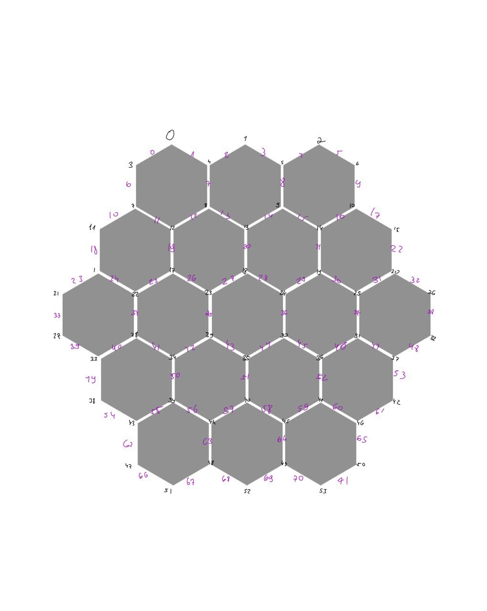

# Catan Game Simulation

This project simulates a simplified version of the popular board game Catan. It demonstrates the core mechanics of the game, including resource management, building roads and settlements, and player interaction. The focus of this simulation is to showcase object-oriented programming principles, particularly inheritance, in a C++ environment.

## General Information and assumptions
### Game Flow
All clasic Catan rules are implemented in this simulation. The game starts with the setup phase where each player places two settlements and two roads. After the setup phase, each player takes turns rolling the dice, collecting resources, and building settlements, roads, and cities. Players can also buy development cards and trade resources with each other. The game continues until a player reaches the victory condition of 10 points.

### Rules changes
- The game is played by 3 players.
- The game board is fixed for all games.
- There is no robber.
- There is no longest road.
- The development cards are: Knight, Victory Point, Road Building, Monopoly, Year of Plenty. and only 13 cards in the deck.
- Players can only trade with each other. (no bank trading or port trading)
- The game ends when a player reaches 10 points.(no 10 points in the same turn rule)

### Assumptions
- Each player sees only his display and public information.
- Players are familiar with the rules of the game.
- Players are familiar with the board index system.

### Board index system

## Overview

The game consists of several key components: players, cards, settlements, roads, and the game itself. Each of these components is represented by classes that interact with each other to simulate the game's mechanics.

The game is controlled by the `CatanGame` class, which manages the game state, player actions, and the game board.
Ownership of the settlements and roads is represented as theyr properties, and the game board is represented by the settlements and roads arrays in the `CatanGame` class.
Therfore there is no need for a board class and also there is no need in assats collections for the players. (because the players will own the settlements and roads forever).

Plesae note that the game is designed to be played in the terminal, and the user interacts with the game through the terminal.

### Key Classes

- `CatanGame`: The main class that controls the game's flow, including setup, rounds, and checking for victory conditions.
- `Player`: Represents a player in the game, holding information about resources, cards, and points.
- `Card`: Represents the development cards that players can buy during the game.
- `Settlement` and `Road`: Represent the buildings that players can construct on the game board.
- `CatanObject`: A base class for any object that can be placed on the game board, such as settlements and roads.

### Inheritance and `CatanObject`

One of the core principles demonstrated in this project is inheritance, particularly through the `CatanObject` class. Both `Settlement` and `Road` classes inherit from `CatanObject`, allowing them to share common attributes and methods, such as ownership and adjacency to other objects on the board. This design choice simplifies the management of game objects and their interactions.

#### `CatanObject` Class

The `CatanObject` class serves as the base class for objects that players can place on the game board. It includes several key attributes:

- `owner`: Indicates which player owns the object.
- `id`: A unique identifier for the object.
- `neighborhood`: An array of pointers to adjacent `CatanObject`s, representing the game board's connectivity.

This class also defines virtual methods like `occupationAttempt(owner player)`, which must be implemented by derived classes to handle the logic of attempting to place an object on the board.

#### Derived Classes: `Settlement` and `Road`

Both `Settlement` and `Road` extend `CatanObject`, inheriting its attributes and overriding virtual methods to implement specific behaviors:

- `Settlement`: Represents a settlement in the game. It includes additional attributes like resources produced and whether it's upgraded to a city.
- `Road`: Represents a road in the game. It's simpler than `Settlement` but crucial for connecting other objects on the board.

### Detailed Functionality in `CatanGame`

The `CatanGame` class encapsulates the core functionality of the game, managing the game state, player actions, and the game board. It is designed with a mix of public and private methods to ensure encapsulation and to manage the game's internal state effectively. The principle of encapsulation is central to the design of the `CatanGame` class, ensuring that the internal workings of the game logic are hidden from external access, thereby safeguarding the integrity of the game's state and behavior.

Encapsulation is achieved by limiting the visibility of the class's methods and properties. In the case of `CatanGame`, this is implemented by having only two public methods: `demo` and `play`. These methods serve as the primary interface for interacting with the game, allowing users to either run a demonstration of the game's mechanics (`demo`) or to play the game (`play`). This design choice simplifies the user interface to the game logic, making it more accessible and easier to use, while also protecting the game's internal state from unintended modifications.

#### Properties

- **`Player players[3]`**: An array of `Player` objects representing the three players participating in the game.

- **`int knightCount[3]`**: An array tracking the number of knight cards each player has played. This is used for determining the largest army.

- **`Settlement settlements[54]`**: An array of `Settlement` objects representing potential locations on the game board where players can build settlements.

- **`Road roads[72]`**: An array of `Road` objects representing potential roads that players can build between settlements.

- **`vector<pair<owner, resource>> payment[11]`**: An array of vectors, where each vector holds pairs of an owner (player) and a resource. This structure is used to manage resources that players will receive based on the dice roll outcome.

- Note: the payment array is used to store the resources that players will receive based on the dice roll outcome. The index of the array corresponds to the dice roll value (2-12), and each element is a vector of pairs, where the first element of the pair is the player who will receive the resource, and the second element is the resource type. this structure can be used to manage the distribution of resources because wen a settlement is built the player will own it forever.

- **`vector<Card> cards`**: A vector of `Card` objects representing the development cards available in the game. These include knights, victory points, road building, monopoly, and year of plenty cards.

#### Public Methods

- `demo()`: Provides a demonstration of the game, showcasing key features and mechanics. This method is particularly useful for understanding the game's flow and for testing purposes.
- `play()`: The main entry point for players to start and play the game. It handles user inputs, game rounds, and the overall game loop, offering a complete gameplay experience.

By restricting direct access to the game's internal mechanisms and exposing only these two methods, `CatanGame` ensures that all interactions with the game logic are controlled and predictable. This not only makes the game more robust by preventing external code from breaking the game's rules or logic but also makes it easier to maintain and extend the game in the future.

#### Private Methods

1. **`init()`**
   - **Use:** Initializes the game board and the deck of development cards. This method sets up the initial state of the game, including the placement of settlements and roads, and prepares the deck of cards for gameplay.

2. **`shuffleCards()`**
   - **Use:** Shuffles the deck of development cards. This ensures that the draw of cards is random, adding an element of luck to the game strategy.

3. **`displayBoard()`**
   - **Use:** Displays the current state of the game board.

4. **`prepRound()`**
   - **Use:** Conducts the round before the game officially starts. This involve initial resource distribution, placement of initial settlements and roads by players.

5. **`diceRoll()`**
   - **Use:** Simulates the rolling of two six-sided dice. The outcome affects resource production and can trigger specific game events (e.g., a roll of 7).

6. **`diceRoll_7()`**
   - **Use:** Handles the special case when the dice roll is 7. Enforcing the discard rule if any player has more than 7 resource cards.

7. **`distributeResources(int dice)`**
   - **Use:** Distributes resources to players based on the current dice roll by using the peymant arry.

8. **`addPayment(owner player, pair<int, resource>* resourceVec)`**
   - **Use:** Adds resources to the payment vector for a specific player for later distribution.

9. **`buildSettlement(int playerId, int settlement_id)`**
   - **Use:** Attempts to build a settlement for a player at a specified location. This involves checking for legal placement(`occupationAttempt(owner player)`), deducting resources, and updating the game state.

10. **`buildRoad(int playerId, int road_id)`**
    - **Use:** Attempts to build a road for a player at a specified location. Similar to building a settlement.

11. **`buildCity(int playerId, int settlement_id)`**
    - **Use:** Upgrades an existing settlement to a city for a player. This increases resource production and victory points.

12. **`buyCard(int playerId)`**
    - **Use:** Allows a player to purchase a development card, deducting the necessary resources and adding the card to the player's hand.

13. **`playerCards(int playerId)`**
    - **Use:** Returns the number of cards a player has. Used for enforcing game rules or for display purposes.

14. **`playCard(int playerId, type card)`**
    - **Use:** Manages the action of a player playing a specific development card, triggering its effects.

15. **`playMonopoly(int playerId)`**
    - **Use:** Executes the effect of the Monopoly card, allowing a player to claim all of a specific resource from other players.

16. **`playYearOfPlenty(int playerId)`**
    - **Use:** Executes the effect of the Year of Plenty card, allowing a player to take any two resources from the bank.

17. **`playRoadBuilding(int playerId)`**
    - **Use:** Executes the effect of the Road Building card, allowing a player to place two roads on the board without using resources.

18. **`intToResource(int res)`**
    - **Use:** Converts an integer value to a corresponding resource type. This could be used for resource management or translation between different representations of resources.

19. **`tradeValues(vector<pair<resource, int>>& values)`**
    - **Use:** Manages the input values for a trade vector.

20. **`makeAnOffer(int playerId, vector<pair<resource, int>>& give, vector<pair<resource, int>>& receive)`**
    - **Use:** Handles a trade offer between players, specifying what resources are being offered and requested.

21. **`makeTrade(int playerId, vector<pair<resource, int>>& give, int otherPlayerId, vector<pair<resource, int>>& receive)`**
    - **Use:** Executes a trade between two players, updating their resource inventories accordingly.

22. **`victroryCheck(int playerId)`**
    - **Use:** Checks knight count and Checks if a player has reached the victory conditions to win the game.

These methods collectively manage the gameplay mechanics, enforcing rules, and updating the game state in response to player actions and game events.

### `play.cpp` and `main.cpp`

The project is structured to include two main entry points, demonstrated in `play.cpp` and `main.cpp`, to showcase different aspects of the game's functionality.

## Makefile Usage

- `make run`: Compiles the game using the `play.cpp` entry point and runs it. This is the main way to play the game.
- `make catan`: Compiles the game using the `main.cpp` entry point and runs it. This is used for demonstrating a specific rounds. 
- `make run_test`: Compiles and runs the test suite.

## Testing

The project includes a test suite to verify the correctness of the game's logic and functionality. Please note that the test suite is only for the public methods meaning that the private methods are not tested directly. even though the most of the methods in `CatanGame` are private, I chose to keep them private because they are not meant to be used outside the class but mainly to keep the game logic clean and organized. I preferd my project incupsulation over testing all the methods directly.

## Conclusion

This project showcases the use of inheritance in C++ to create a flexible and extensible simulation of the Catan board game. By using a common base class for game objects, it simplifies the management of different object types and their interactions, demonstrating a fundamental principle of object-oriented design.

### Authors

- Hagay Cohen <hagaycohen2@gmail.com>

